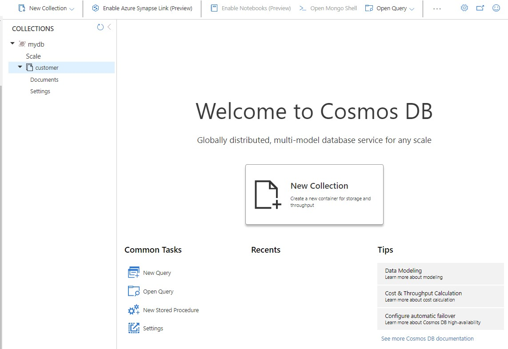
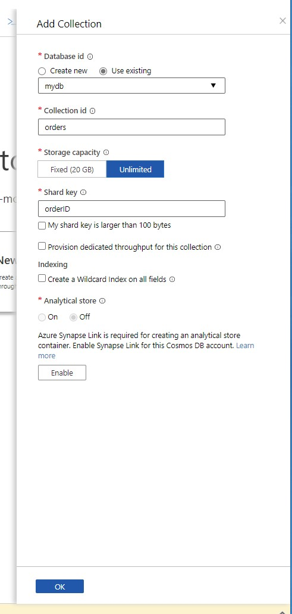
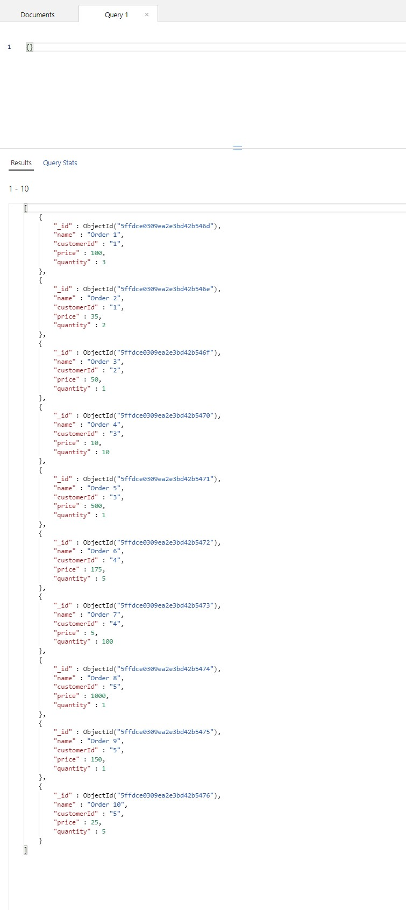
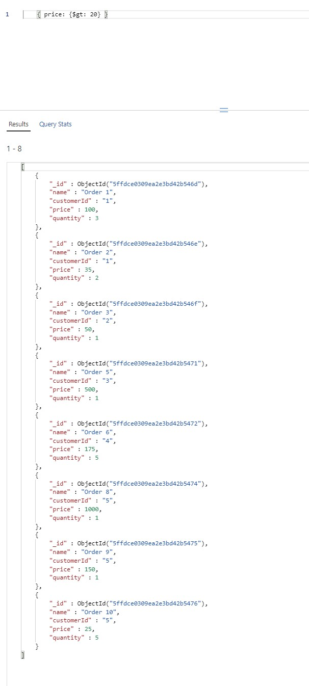
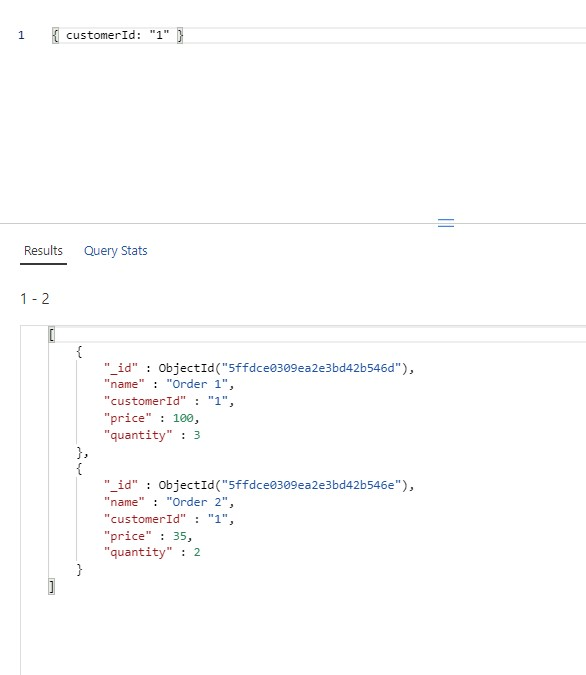

# Module 7: Implementing data storage in Azure

# Lesson 3: Working with Structured Data in Azure

### Demonstration: Using Microsoft Azure Cosmos DB with the MongoDB API

- Creamos una cuenta de Azure Cosmos DB **mod7demo3fjmq** del tipo MongoDB 

  




- Pulsamos sobre **New Collection**  para crear una nueva colección **customers**  con un nuevo Database id **mydb**

- Creamos otra una nueva colección **orders** con el Database id **mydb**

  

- pulsamos sobre **New Shell**.

- copiamos el contenido del **CustomersCollectionData.json** en la shell y pulsamos Enter

- copiamos el contenido del **OrdersCollectionData.json** en la shell y pulsamos Enter

- Boton derecho en **orders**, y seleccionamos**New Query**.

- Para ver todos los pedidos escribimos

   ```json
    {}
   ```



- Para ver todos los pedidos escribimos con precio superior a 20$ escribimos

   ```query
    { price: {$gt: 20} }
   ```



- Para ver todos los pedidos del cliente 1 escribimos

   ```query
    { customerId: "1" }
   ```

